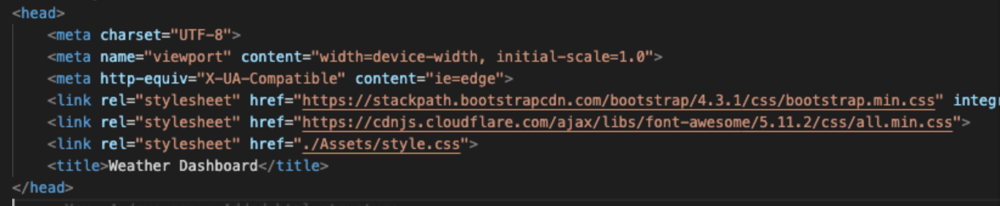
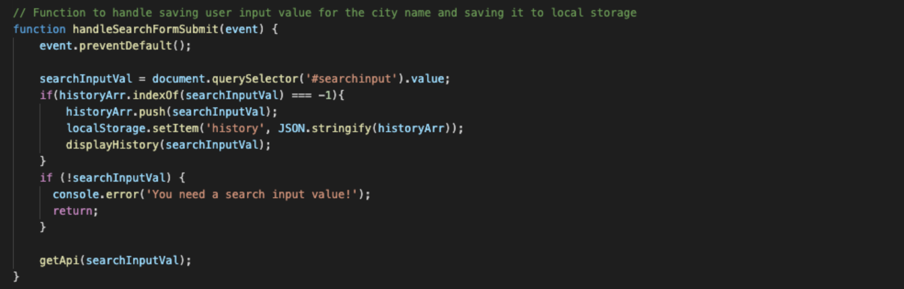
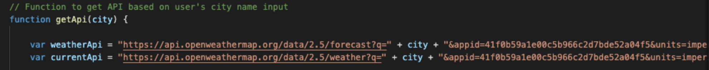
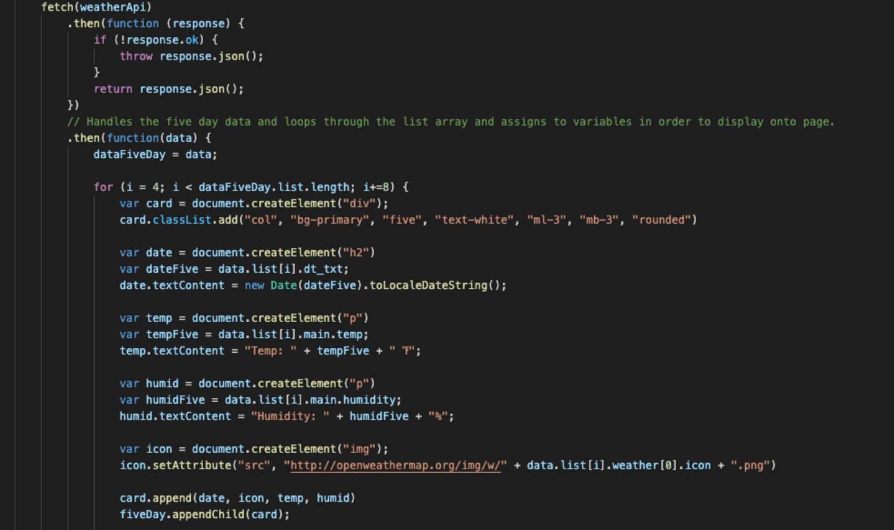
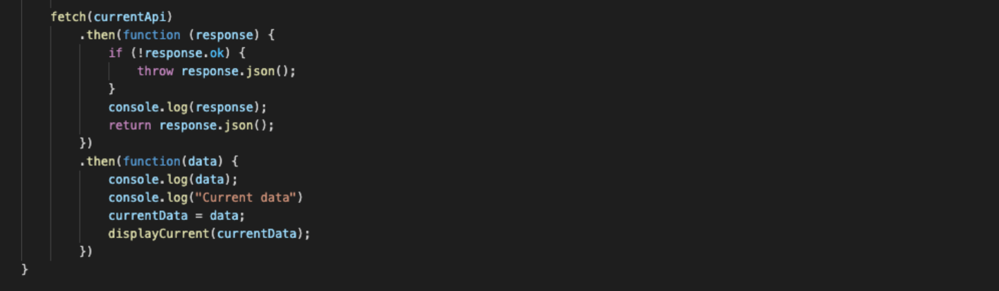
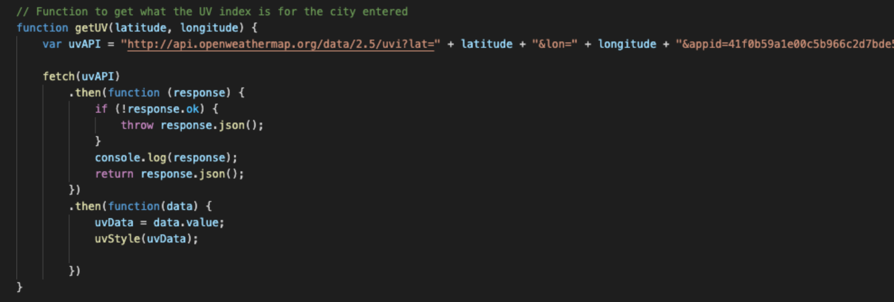
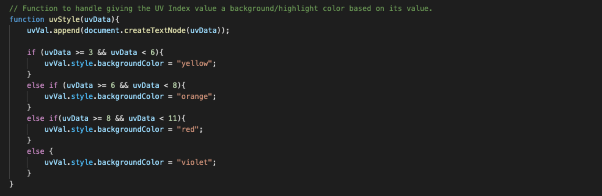
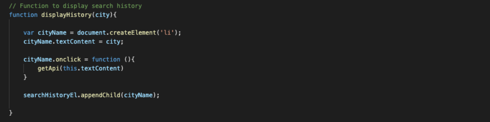
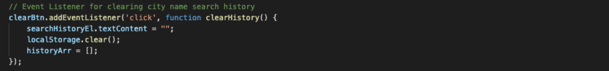

# Weather-Dashboard

This application utilizes the [OpenWeather API](https://openweathermap.org/api) to retrieve weather data for cities so that when a user searches a specific city, they will be able to see the current and five-day weather for that city.

## User Story

```
AS A traveler
I WANT to see the weather outlook for multiple cities
SO THAT I can plan a trip accordingly
```

## Acceptance Criteria

```
GIVEN a weather dashboard with form inputs
WHEN I search for a city
THEN I am presented with current and future conditions for that city and that city is added to the search history
WHEN I view current weather conditions for that city
THEN I am presented with the city name, the date, an icon representation of weather conditions, the temperature, the humidity, the wind speed, and the UV index
WHEN I view the UV index
THEN I am presented with a color that indicates whether the conditions are favorable, moderate, or severe
WHEN I view future weather conditions for that city
THEN I am presented with a 5-day forecast that displays the date, an icon representation of weather conditions, the temperature, and the humidity
WHEN I click on a city in the search history
THEN I am again presented with current and future conditions for that city
```

## Mock-Up

The following image shows the web application's appearance and functionality:


## Project Development Process

### HTML

The HTML was put together first in order to lay out how the application worked. We started with the head where all of the links to both internal and external style sheets were added:



From here, we created a nav bar for the webpage heading, a section for the search input field and search history, a section for the current weather, and a section for the 5-day weather display. All of these sections utilize bootstrap in order to get the desired formatting.

Lastly, the scripts were included at the bottom of the html in order to link to the script file, as well as the moment.js API which is used in the script file code itself. 

### Sript

The bulk of the work was done in the script file. To start, a event listener for the search button was created in order to initiate a function that captures what the user entered, and then use that input in order to manipulate/utilize the weather API:



Here, we are also storing the user's input into local storage in order to allow the search history to be displayed, even after the page is refreshed and until the user decides to clear the history. So, this function passes the input value to the function where the API is "fetched":



Above, you can see we have two different API's: one is for purposes of the 5-day weather, and the other is for the current weather. Further down in this function, we fetch the API's in order to get the data we want:



Above we are doing this for the five-day weather data and then using that data to display what we want onto the actual page itself. This is done through the create element and appending methods.

Next, we want to handle getting the data for the current weather. We followed a similar method to the 5-day weather as shown below. However, in this scenario, instead of handling getting the data we want and displaying it within the fetch itself, we actually call a new function and pass to it the data we want:



So now in the displayCurrent function, we actually handle displaying the information onto the page. This is also done through the append method. Also note, that in this function, in order to get the UV Index, we need to call a separate API. So, from the current weather data, we need to get the latitude and longitude values of that city, and then call the function getUV in order to get the actual UV index:



In order to do this, we use another API and pass into it the lat and lon values. You can also see in the photo above that we also call the uvStyle function within the getUV function. This function being called is what adjusts the highlight color of the UV Index value itself according to the specific numerical value:



Lastly, we want to display the search history and allow this city history list to be clickable so that when the user clicks a city from the history list, they are then again presented with that city's weather. Below, you can see how this was all done within one function:



And then finally, we added an event listener for the clear history button so that the search history was cleared and the displayed list of sities search was removed:




## Credits

Moment JS - [Moment Display](https://momentjs.com/docs/#/displaying/)

Bootstrap - [Containers](https://getbootstrap.com/docs/5.0/layout/containers/)

Bootstrap - [Forms](https://getbootstrap.com/docs/5.0/forms/overview/)

MDN Web Docs - [Fetching Data from the Server](https://developer.mozilla.org/en-US/docs/Learn/JavaScript/Client-side_web_APIs/Fetching_data)

MDN Web Docs - [Manipulating Documents](https://developer.mozilla.org/en-US/docs/Learn/JavaScript/Client-side_web_APIs/Manipulating_documents)

Open Weather - [Open Weather API Documentation](https://openweathermap.org/api)

## Links

GitHub Repository - [Work-Day Scheduler Repository](https://github.com/ktrudickm/Weather-Dashboard "Weather Dashboard Repository")

Deployed Project - [Deployed Application](https://ktrudickm.github.io/Weather-Dashboard/ "Deployed Application")